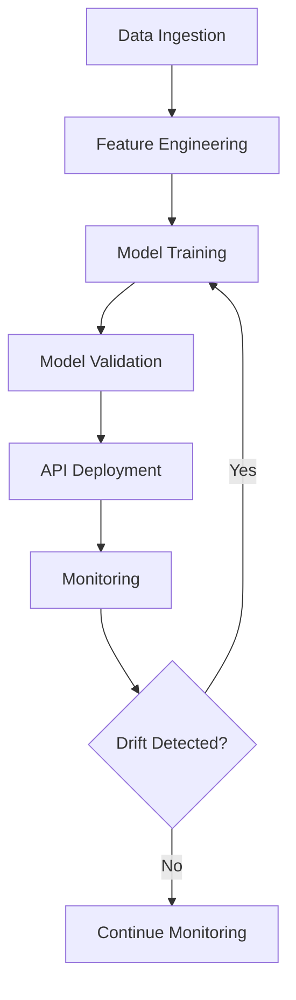

# Automated Cash Flow Generation System

A comprehensive MLOps pipeline for automated cash flow forecasting using machine learning models, real-time data ingestion, and production-grade deployment.

## 🎯 System Overview

This system provides end-to-end automation for cash flow forecasting with the following capabilities:

- **Real-time Data Ingestion**: Automated collection of financial market data
- **ML Model Training**: Continuous model training and retraining based on new data
- **Predictive Analytics**: Cash flow predictions with risk assessment
- **Production API**: RESTful API for real-time predictions
- **Monitoring & Alerting**: Comprehensive system health monitoring
- **Automated Backups**: Data and model backup with retention policies

## 🏗️ Architecture

```
┌─────────────────┐    ┌─────────────────┐    ┌─────────────────┐
│   Data Sources  │    │   Airflow DAG   │    │   ML Models     │
│                 │───▶│   Pipeline      │───▶│   & Training   │
│ - Alpha Vantage │    │                 │    │                 │
│ - FRED API      │    │ - Data Ingest   │    │ - Random Forest │
│ - Market Data   │    │ - Feature Eng   │    │ - Risk Models   │
└─────────────────┘    │ - Model Train   │    └─────────────────┘
                       │ - API Deploy    │              │
                       └─────────────────┘              │
                                │                       │
                       ┌─────────────────┐    ┌─────────────────┐
                       │   FastAPI       │    │   Monitoring    │
                       │   Service       │    │   (Grafana)     │
                       │                 │    │                 │
                       │ - /predict      │    │ - Metrics       │
                       │ - /health       │    │ - Alerts        │
                       └─────────────────┘    └─────────────────┘
```

## 🚀 Quick Start

### Prerequisites

- Docker & Docker Compose
- PowerShell (Windows) or Bash (Linux/Mac)
- API keys for:
  - Alpha Vantage
  - FRED (Federal Reserve Economic Data)

### Setup Instructions

1. **Clone and Navigate**
   ```bash
   cd automated-cashflow-pipeline
   ```

2. **Configure Environment Variables**
   ```bash
   # Copy example environment file
   cp .env.example .env
   
   # Edit .env file with your API keys
   ALPHA_VANTAGE_KEY=your_alpha_vantage_key
   FRED_API_KEY=your_fred_api_key
   API_TOKEN=your_secure_api_token
   ```

3. **Start the System**
   ```bash
   # Start all services
   docker-compose -f docker-compose.prod.yml up -d
   
   # Check service status
   docker-compose -f docker-compose.prod.yml ps
   ```

4. **Verify Installation**
   - Airflow UI: http://localhost:8080 (admin/admin)
   - Grafana: http://localhost:3000 (admin/admin)
   - MLflow: http://localhost:5000
   - API: http://localhost:8002/health

## 📊 Usage

### Running Predictions

**Via API (Recommended)**
```bash
# Test the API
curl -X POST http://localhost:8002/predict \
  -H "Authorization: Bearer your_api_token" \
  -H "Content-Type: application/json" \
  -d '{
    "data": {
      "stock_price": 150.25,
      "volatility": 0.12,
      "volume": 1000000,
      "sma_20": 145.50,
      "rsi": 65.5
    }
  }'
```

**Via PowerShell Script**
```powershell
# Run load test
.\simulate_api_load.ps1 -Requests 100 -Concurrent 5
```

### Airflow DAG Operations

1. **Trigger Manual Run**
   - Navigate to http://localhost:8080
   - Find `cashflow_pipeline` DAG
   - Click "Trigger DAG"

2. **Monitor Execution**
   - View task logs in Airflow UI
   - Check MLflow for model metrics
   - Monitor Grafana dashboards

### Data Pipeline Flow



## 🔧 Configuration

### Environment Variables

| Variable | Description | Default |
|----------|-------------|---------|
| `ALPHA_VANTAGE_KEY` | Alpha Vantage API key | Required |
| `FRED_API_KEY` | FRED API key | Required |
| `API_TOKEN` | API authentication token | `secure_token` |
| `AIRFLOW_UID` | Airflow user ID | `50000` |
| `MODEL_PATH` | Path to ML model | Auto-detected |

### Docker Resources

**Financial API Service**
- CPU Limit: 0.5 cores
- Memory Limit: 512MB
- Restart Policy: Unless stopped

**Airflow Services**
- CPU Limit: 1 core per service
- Memory Limit: 1GB per service
- Health checks enabled

## 📈 Monitoring

### Grafana Dashboards

Access dashboards at http://localhost:3000

1. **System Overview**
   - CPU/Memory usage
   - Network traffic
   - Disk utilization

2. **Application Metrics**
   - API response times
   - Request rates
   - Error rates
   - Model performance

3. **Business Metrics**
   - Prediction accuracy
   - Cash flow trends
   - Risk alerts

### Alerting Rules

- **High Response Time**: >2s average
- **High Error Rate**: >5% in 5min window
- **Model Drift**: >10% accuracy drop
- **Resource Usage**: >80% CPU/memory

## 🔄 Maintenance

### Automated Backups

**Daily Backups** (2 AM)
- Airflow database
- MLflow experiments
- Trained models
- Configuration files

**Retention Policy**
- Daily backups: 7 days
- Weekly backups: 4 weeks
- Monthly backups: 12 months

### Manual Backup

```bash
# Create backup
.\backup_system.ps1

# Restore from backup
.\restore_system.ps1 -BackupFile "backup_20240101.tar.gz"
```

### Model Retraining

**Automatic**
- Triggered weekly via Airflow
- Based on drift detection
- Performance threshold: <85% accuracy

**Manual**
```bash
# Trigger immediate retraining
docker-compose -f docker-compose.prod.yml run --rm airflow-worker airflow dags trigger model_retrain_dag
```

## 🐛 Troubleshooting

### Common Issues

**Port 8002 Already in Use**
```bash
# Find process using port
netstat -ano | findstr :8002
# Kill process
taskkill /PID <PID> /F
```

**Docker Issues**
```bash
# Restart services
docker-compose -f docker-compose.prod.yml restart

# Rebuild containers
docker-compose -f docker-compose.prod.yml up -d --build

# View logs
docker-compose -f docker-compose.prod.yml logs -f financial-api
```

**API Not Responding**
```bash
# Check health
curl http://localhost:8002/health

# Check logs
docker logs financial-api

# Restart API
docker-compose -f docker-compose.prod.yml restart financial-api
```

### Performance Tuning

**Optimize API Performance**
1. Adjust Docker resource limits in `docker-compose.prod.yml`
2. Scale workers: modify `gunicorn -w 4` in `Dockerfile.financial-api`
3. Enable caching for repeated predictions

**Database Optimization**
- Use connection pooling
- Add indexes for frequent queries
- Monitor query performance

## 🔒 Security

### API Security
- Bearer token authentication
- Rate limiting (100 requests/minute)
- Input validation and sanitization
- HTTPS support (production)

### Data Security
- Encrypted data at rest
- Secure API key management
- Audit logging
- Network isolation via Docker networks

## 📚 API Reference

### Endpoints

#### POST /predict
Generate cash flow prediction

**Request:**
```json
{
  "data": {
    "stock_price": 150.25,
    "volatility": 0.12,
    "volume": 1000000,
    "sma_20": 145.50,
    "sma_50": 142.30,
    "rsi": 65.5,
    "macd": 2.1,
    "bollinger_upper": 155.80,
    "bollinger_lower": 144.70,
    "vix": 18.5,
    "treasury_10y": 3.45,
    "dollar_index": 102.3
  }
}
```

**Response:**
```json
{
  "prediction": 125.50,
  "risk_flag": 0,
  "position_size": 1.25
}
```

#### GET /health
Health check endpoint

**Response:**
```json
{
  "status": "healthy",
  "timestamp": "2024-01-01T12:00:00Z"
}
```

## 📊 Data Sources

This system is configured to use **cost-free data sources** exclusively:

- **Alpha Vantage**: Provides global stock market data, technical indicators, and financial metrics.
- **FRED (Federal Reserve Economic Data)**: Supplies macroeconomic indicators like interest rates and inflation data.

*Note: The system previously supported ICICI Breeze broker-specific data but has been optimized to rely solely on these free APIs, reducing costs and dependencies while maintaining full functionality.*

## 🧪 Testing Guide

This section outlines the end-to-end validation steps for the Automated Cash Flow Generation System.

### Step 1: Airflow DAG Execution

**Objective**: Verify the data pipeline, feature engineering, and model training processes.

**Procedure**:
1. Access the Airflow UI at `http://localhost:8080` (admin/admin).
2. Manually trigger the `cashflow_pipeline` DAG.
3. Monitor the DAG run to ensure all tasks (data ingestion, feature engineering, model training) complete successfully.

**Expected Outcome**:
- All DAG tasks should show a 'success' status.
- New models should be trained and registered (visible in MLflow at `http://localhost:5000`).

### Step 2: API Prediction Validation

**Objective**: Confirm the FastAPI `/predict` endpoint is functional, authenticates correctly, and returns valid predictions.

**Procedure**:
1. Ensure the `financial-api` service is running.
2. Execute the `test_api.py` script located in the project root:
   ```bash
   python test_api.py
   ```

**Expected Outcome**:
- The script should report "Health check passed" and "Prediction successful!".
- A valid prediction, risk flag, and position size should be displayed (e.g., Prediction: 103.0, Risk Flag: 1, Position Size: 1.03).

### Step 3: Monitoring and Alerts Verification

**Objective**: Validate that Grafana dashboards are updating with metrics and that the system can simulate and recover from failures.

**Procedure**:
1. Access Grafana at `http://localhost:3000` (admin/admin) and observe the dashboards for updated API metrics (latency, request rates).
2. Simulate API failure by stopping the `financial-api` container:
   ```bash
   docker compose -f docker-compose.prod.yml stop financial-api
   ```
3. Observe the Grafana dashboard for changes (e.g., CPU drop, potential alerts).
4. Restart the `financial-api` container:
   ```bash
   docker compose -f docker-compose.prod.yml start financial-api
   ```
5. Confirm recovery on the Grafana dashboard.

**Expected Outcome**:
- Grafana dashboards should reflect API activity and then show a drop in metrics when the API is stopped.
- Metrics should recover to normal levels after the API is restarted.

### Step 4: Backup System Verification

**Objective**: Confirm the automated backup system is functioning correctly.

**Procedure**:
1. Execute the backup script:
   ```powershell
   powershell.exe -File backup_system.ps1
   ```
2. Check the `backups/` directory for newly created backup files (e.g., `airflow_db_YYYYMMDD_HHMM.sql`, `mlruns_YYYYMMDD_HHMM/`, `models_YYYYMMDD_HHMM/`).
3. Verify the `backups/backup_log.txt` file contains a recent success entry.

**Expected Outcome**:
- New backup files should be present in the `backups/` directory with a current timestamp.
- The `backup_log.txt` should contain a line indicating a successful backup completion at the corresponding timestamp.

## 🤝 Contributing

1. Fork the repository
2. Create feature branch: `git checkout -b feature/new-feature`
3. Commit changes: `git commit -am 'Add new feature'`
4. Push to branch: `git push origin feature/new-feature`
5. Create Pull Request

## 📄 License

This project is licensed under the MIT License - see the [LICENSE](LICENSE) file for details.

## 🆘 Support

For support, please:
1. Check the troubleshooting section
2. Review logs using `docker-compose logs`
3. Create an issue on GitHub
4. Contact: [your-email@example.com]

## 🎉 Demo Video

Watch the system demo: [Link to demo video]

---

**System Status**: ✅ Production Ready  
**Last Updated**: January 2025  
**Version**: 1.0.0